# SplitWise - Expense Splitting App

SplitWise is a **full-stack** application designed to simplify the process of tracking and splitting expenses with friends and groups. This project features a modern Android application built with **Jetpack Compose** and a robust backend infrastructure.

The backend is a custom-built API developed using **TypeScript** and **NestJS**, deployed in the cloud to provide a seamless, real-time experience for users.

> **Note:** This repository contains the Android client code. The backend source code is maintained in a separate repository.

## 📸 Screenshots

### **Onboarding & Authentication**
| Onboarding | Login | Signup |
| :---: | :---: | :---: |
| 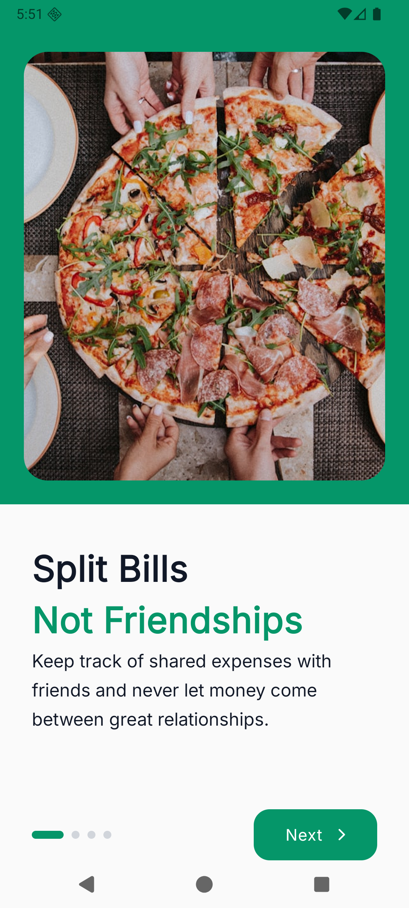 | 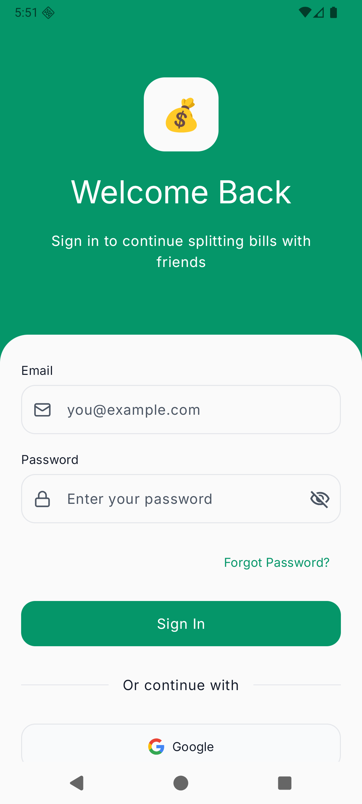 | 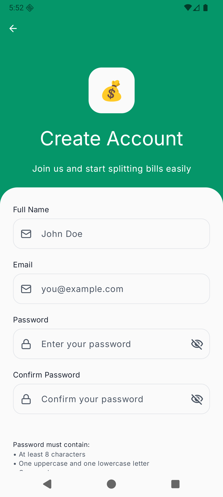 |

### **Main Experience**
| Dashboard | Activity Feed | Friends List |
| :---: | :---: | :---: |
| 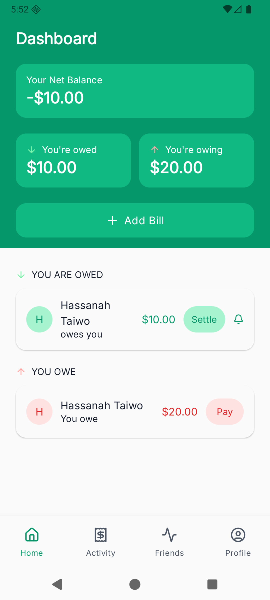 | 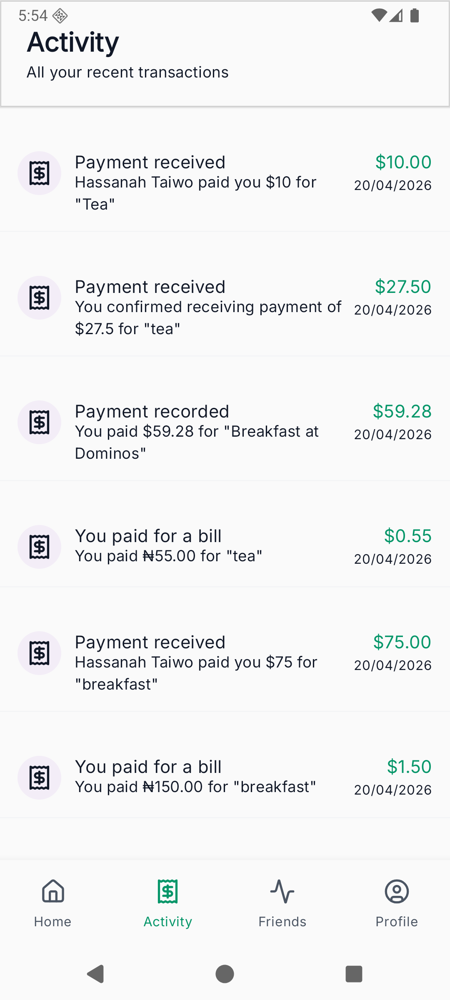 | 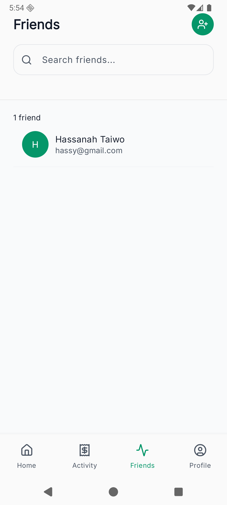 |

### **Bill Management**
| Settle Bill | Send Reminder | User Profile |
| :---: | :---: | :---: |
| 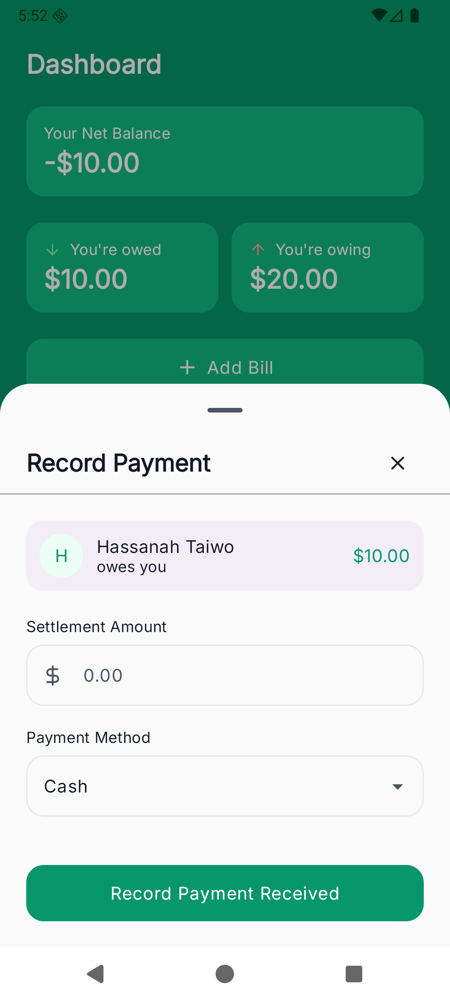 | 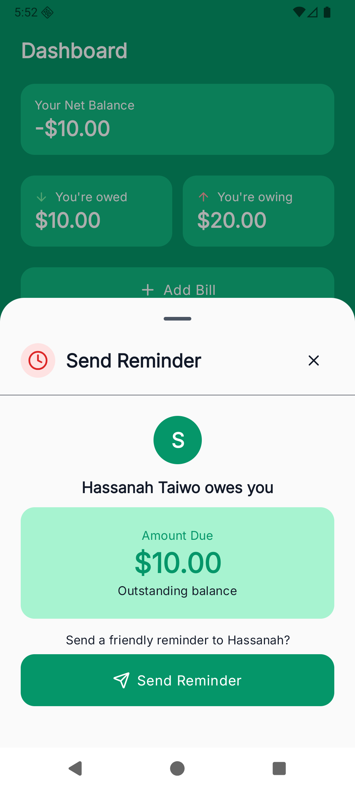 | 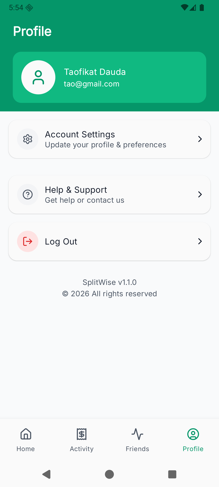 |

### **Multi-step Bill Creation**
| Step 1: Details | Step 2: Participants | Step 4: Payer |
| :---: | :---: | :---: |
| 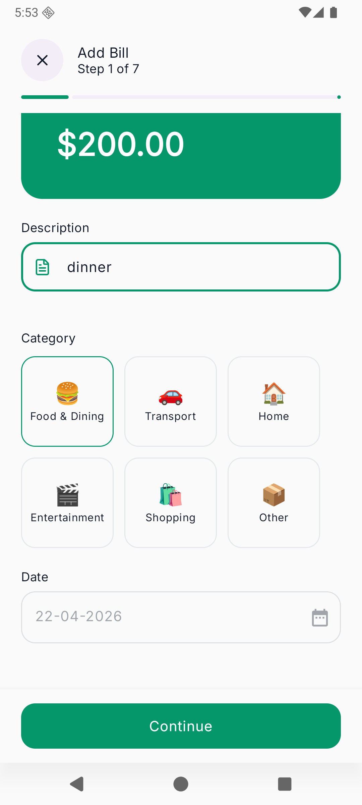 | 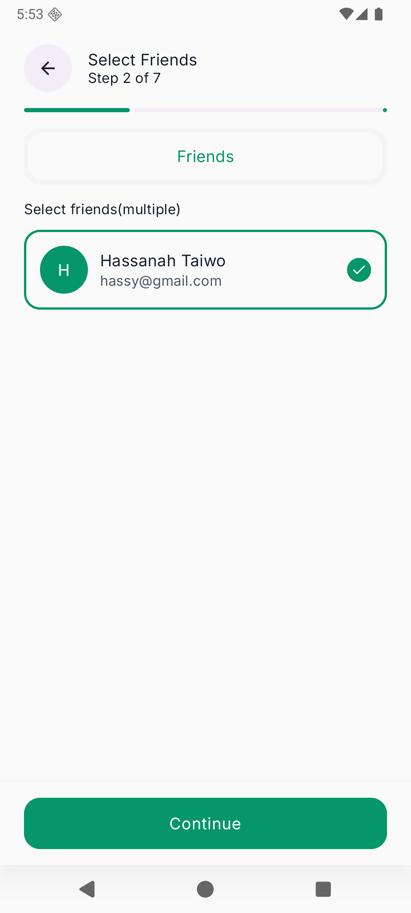 | 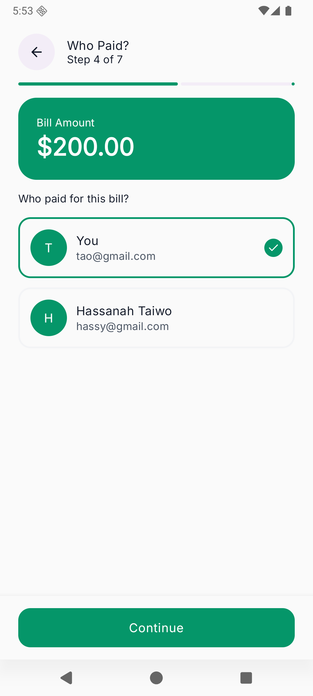 |

| Step 5: Split Method | Step 6: Adjustments | Step 7: Review |
| :---: | :---: | :---: |
| 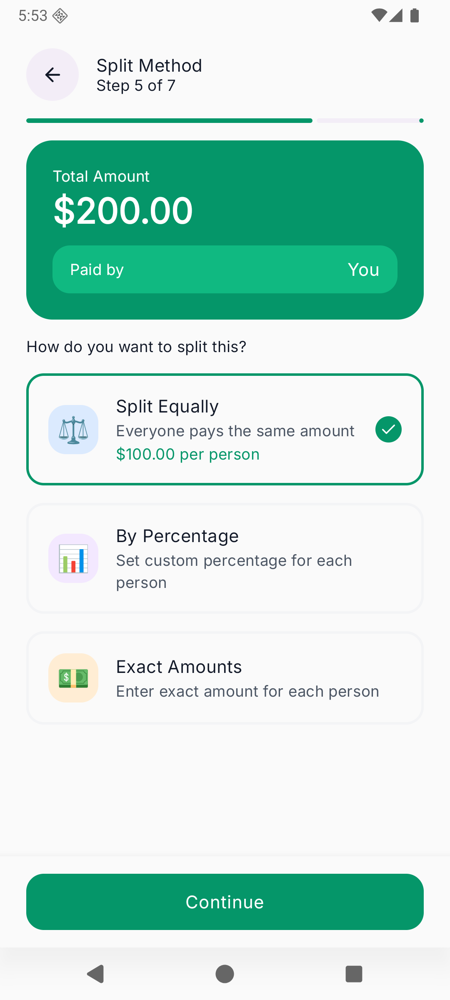 | 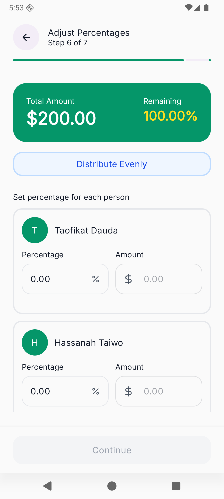 | 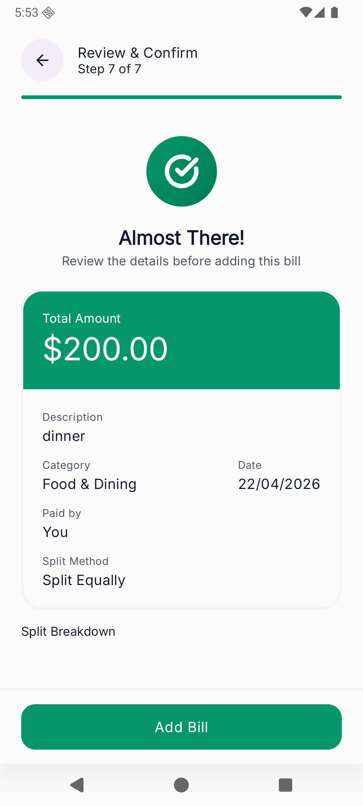 |

## 🚀 Features

### **Core Functionality**
- **Multi-step Bill Creation:** A guided 7-step process to add bills, select participants, define payers, and choose split methods.
- **Flexible Splitting:** Support for various split methods including:
    - **Equal:** Automatically divides the total amount among all participants.
    - **Percentage:** Define custom percentages for each individual.
    - **Exact Amount:** Specify precise amounts for each participant.
- **Group & Friend Management:** Organize expenses by specific groups or individual friends.
- **Dashboard & Activity:** Track your total balance (owed vs. owing) and view a real-time activity feed of all transactions.

### **Account & Security**
- **Secure Authentication:** Robust login and signup flows with encrypted token storage.
- **Profile Management:** Update personal information and manage account settings.
- **Firebase Integration:** Push notifications via Firebase Cloud Messaging (FCM) for bill reminders and activity updates.
- **Privacy Controls:** Secure password changes and account deletion options.
- **Code Protection:** Integrated R8/ProGuard rules for code obfuscation and shrinking.

## 🛠 Tech Stack

### **Android (Frontend)**
- **UI:** [Jetpack Compose](https://developer.android.com/jetpack/compose) - Modern, declarative UI toolkit.
- **Architecture:** MVVM (Model-View-ViewModel) with Clean Architecture principles.
- **Dependency Injection:** [Hilt](https://dagger.dev/hilt/) - Standard library for DI in Android.
- **Networking:** [Retrofit](https://square.github.io/retrofit/) & [OkHttp](https://square.github.io/okhttp/) for REST API communication.
- **Reactive Programming:** Kotlin [Coroutines](https://kotlinlang.org/docs/coroutines-overview.html) and [Flow](https://kotlinlang.org/docs/flow.html) for asynchronous data handling.
- **Pagination:** [Paging 3](https://developer.android.com/topic/libraries/architecture/paging/v3-overview) for efficient loading of large activity feeds and bill lists.
- **Local Storage:** [DataStore](https://developer.android.com/topic/libraries/architecture/datastore) & EncryptedSharedPreferences for secure data persistence.
- **Security & Optimization:** [R8/ProGuard](https://developer.android.com/studio/build/shrink-code) for code shrinking, obfuscation, and optimization.
- **Backend Services:** Firebase Analytics, Crashlytics, and Cloud Messaging.

### **Backend**
- **Framework:** [NestJS](https://nestjs.com/) (Node.js framework)
- **Language:** TypeScript
- **Deployment:** Cloud-hosted API
- **Repository:** Private/Separate repository

## 🏗 Project Structure

The project follows a feature-based package structure for high maintainability:

```text
com.omodauda.splitwise
├── data
│   ├── local        # DataStore, Preferences, Encrypted Storage
│   ├── network      # API Interfaces, DTOs, Interceptors, Paging Sources
│   └── repository   # Single source of truth for data logic
├── di               # Hilt Modules (Network, Storage, etc.)
├── model            # Domain models and UI state classes
├── services         # Firebase Messaging Service
└── ui
    ├── components   # Reusable UI widgets (Buttons, Toasts, Loaders)
    ├── features     # Feature-specific screens and ViewModels
    │   ├── auth     # Login, Signup, Forgot Password
    │   └── main     # Dashboard, Add Bill, Groups, Friends, Activity
    └── theme        # Material3 Design System (Color, Typography, Shape)
```

## 🚦 Getting Started

### **Prerequisites**
- Android Studio Ladybug or newer.
- JDK 11+.
- A `local.properties` file containing your `BASE_URL`.
- A `google-services.json` file in the `app/` directory (required for Firebase features).

### **Installation**
1. Clone the repository.
2. Add your `BASE_URL` to the `local.properties` file.
3. Place your `google-services.json` in the `app/` folder.
4. Sync the project with Gradle files.
5. Run the app on an emulator or physical device.

## 📈 Future Roadmap
- [ ] Offline support with Room database.
- [ ] Unit and UI testing suite.
- [ ] Group management (creation, editing, member management).
- [ ] Group-specific expense tracking and settlements.
- [ ] Image upload support for receipts.
- [ ] Dynamic deep linking for group invites.

---
*Developed as a showcase of modern Android development practices.*
